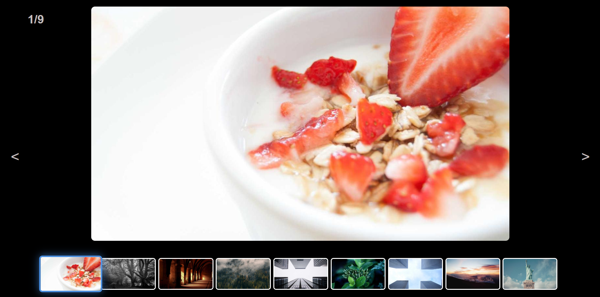

# 🖼️ Image Showcase

Интерактивная галерея изображений с плавной навигацией и активными миниатюрами.

---

## 📋 Описание

**Image Showcase** — это лёгкий и минималистичный проект на **JavaScript**, который позволяет удобно просматривать изображения.  
Пользователь может переключаться между картинками с помощью кнопок **Next / Prev** или кликом по миниатюрам.  
Активная миниатюра подсвечивается, а основное изображение плавно обновляется с анимацией.

Проект подойдёт для:
- 🎨 Портфолио фотографа или дизайнера  
- 🖼️ Демонстрации визуальных работ  
- 💡 Изучения DOM, событий и манипуляций с элементами в JavaScript  

---

## ⚙️ Функциональность

- 🔁 Переключение изображений стрелками  
- 🖱️ Выбор изображения через миниатюры  
- ✨ Подсветка активного изображения  
- 🎞️ Плавная анимация смены фото  

---

## 🧩 Технологии

- **HTML5**
- **CSS3** (адаптивная сетка, плавные переходы)
- **Vanilla JavaScript (ES6)**

---

## 🚀 Запуск проекта

1. Клонируй репозиторий:
   ```bash
   git clone https://github.com/username/image-showcase.git
   
    # Переходим в директорию проекта
    cd image-showcase

    # Открываем в браузере
    index.html
   ```

## 🪄 Превью 


---

🧠 Идея проекта

Проект создан как тренировка для закрепления навыков работы с DOM, событиями, циклами и динамическим обновлением интерфейса.
Главный акцент сделан на простоте, чистом дизайне и понятной структуре кода.

👨‍💻 Автор

Exmar — Fullstack Developer

📧 Telegram: @Exmar1
